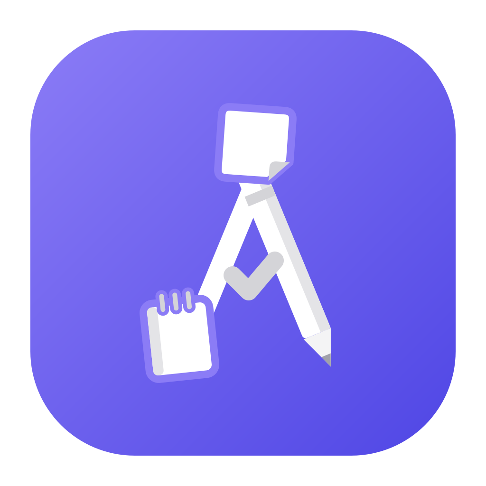

<p align="center"></p>

# Astali

**A ST**udent **A**ll **LI**fe: a planning tool made with students in mind, so that anyone can plan, study and
organize their projects without paying for it.

> **Astali is, and always will be, completely free, open source and ad-free.**
> No subscriptions, no paid tiers, no ads, no tracking. Your data stays in plain files on your computer.

Read how it started and why it exists in [The story of Astali](docs/story.md).

## Download

Get the latest version from [Releases](../../releases/latest). The app updates itself from there.

---

A local-first desktop app for planning. Everything is stored as plain JSON in a folder you choose (your *vault*),
and a built-in MCP server lets Claude or any other AI agent work in it alongside you.

## Features

- **Kanban boards**: projects → boards → columns → tasks, with drag and drop, tags, priorities, due dates,
  checklists and WIP limits
- **Plans**: ordered steps with nested checklists and open questions, for a feature, an issue or a thesis
- **Notes boards**: post-its on an endless grid you pan and zoom, which you can promote into tasks, plan steps or decisions
- **Decisions**: short notes on *why* things are the way they are, searchable by class name or path
- **GitHub**: read-only issue import, and columns that always show the issues with a given label
- **History and undo**: every change, yours or an AI agent's, is recorded and can be undone
- Live reload when the vault changes on disk, dark and light themes, custom colors

## Use it with AI (MCP)

The app is also an MCP server. Register it with Claude Code:

```
claude mcp add astali --scope user "--" "C:\path\to\astali.exe" mcp --vault "D:\path\to\vault"
```

Keep the quotes around `"--"`: PowerShell drops a bare `--`. Settings → *AI integration* has ready-to-copy commands
for Claude Code and Claude Desktop.

## Development

Requires Node 20+, Rust (stable, MSVC on Windows) and WebView2. Built with **Tauri 2** + **React / TypeScript**.

```
npm install
npm run tauri dev      # run with hot reload
npm run tauri build    # exe + installers in src-tauri/target/release/bundle
cd src-tauri && cargo test
```

VS Code debug configurations (Rust, WebView, MCP server) are in `astali.code-workspace`.

## About this repository

This repository is updated automatically every night with the latest source code, so its history is one commit per
day. Releases are built and published from here.

Issues and ideas are welcome: see [Contributing](CONTRIBUTING.md).

## License

[MIT](LICENSE). Free forever: no ads, no paywall, no paid tier. Third-party licenses are credited in
**Settings → Credits**.
